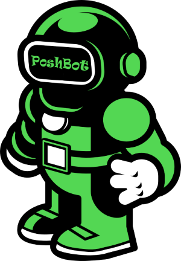
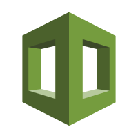
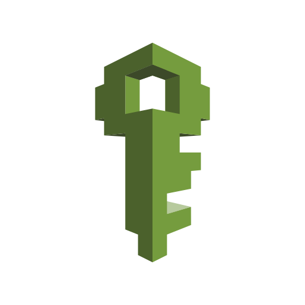
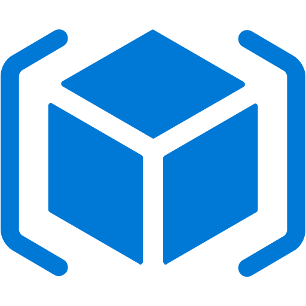
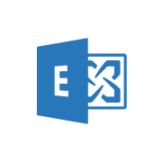

# Rubrik API Integrations for Every Use Case
Integrating Rubrik into your enterprise tools and workflows has never been easier. Use our Rubrik and Community supported SDKs, Integrations, and Use-Cases to build on top of and integrate Rubrik into your existing or new automated data management workflows.

## Project Types

Rubrik has three different types of projects centering around API consumption:

* **SDKs** - SDKs allow the creation of applications in a specific programming language. These are great if you understand a certain language and want to hit the ground running with consuming Rubrik APIs.
* **Tooling Integrations** - Tooling Integrations seamlessly integrate with Rubrik to make testing, development or monitoring tasks easier and more efficient. These are great if you are looking to integrate Rubrik workflows into popular automation toolsets such as Ansible and Terraform.
* **Use Cases** - Use Cases are automated workflows that can be leveraged in your environment to achieve a very specific goal. All use-cases come with easy to follow, step by step quickstart guides.

## Support
Depending on the SDK, Integration, or Use Case one of the following support models are applied:

* **Rubrik Supported** - a project that is owned and maintained by Rubrik while accepting contributions from the community
* **Community Supported** - a project that is owned and maintained by the Build community
* **Partner Supported** - a project that is owned and maintained by a Partner and Rubrik while accepting contributions from the community

The `README.md` of each repository should designate the project type.

## Project Listing

### Rubrik Supported

The following projects are officially supported by Rubrik

  <table>
    <tr><td align="center" colspan="3"><b>Rubrik Supported Software Development Kits</b></td></tr>
    <tr>
      <td align="center" width="33%"></td>
      <td align="center" width="33%"></td>
      <td align="center" width="33%"></td>
    </tr>
    <tr>
      <td align="center" valign="top" width="33%">Rubrik Security Cloud Powershell SDK</td>
      <td align="center" valign="top" width="33%">Rubrik Security Cloud Python SDK</td>
      <td align="center" valign="top" width="33%">Rubrik Security Cloud GO SDK</td>
    </tr>
    <tr>
      <td align="center" width="33%"><a href="">Code</a> | <a href="">Documentation</a> |   <a href="">Quickstart</a></td>
      <td align="center" width="33%"><a href="">Code</a> | <a href="">Documentation</a> | <a href="">Quickstart</a></td>
      <td align="center" width="33%"><a href="">Code</a> | <a href="">Documentation</a> | <a href="">Quickstart</a></td>
    </tr>
    <tr><td colspan=3 align="center"><B>Rubrik Supported Tooling Integrations</B></td></tr>
    <tr>
      <td align="center" width="33%"></td>
      <td align="center" width="33%"></td>
      <td align="center" width="33%"></td>
    </tr>
    <tr>
      <td align="center" valign="top" width="33%">Rubrik Security Cloud Terraform Plugin</td>
      <td align="center" valign="top" width="33%">Rubrik Security Cloud Service Now Integration</td>
      <td align="center" valign="top" width="33%">Rubrik Security Cloud vRA/vRO Plugin</td>
    </tr>
    <tr>
      <td align="center" width="33%"><a href="">Code</a> | <a href="">Documentation</a> | <a href="">Quickstart</a></td>
      <td align="center" width="33%"><a href="">Code</a> | <a href="">Documentation</a> | <a href="">Quickstart</a></td>
      <td align="center" width="33%"><a href="">Code</a> | <a href="">Documentation</a> | <a href="">Quickstart</a></td>
    </tr>
    <tr>
      <td align="center" width="33%"></td>
      <td align="center" width="33%"></td>
      <td align="center" width="33%"></td>
    </tr>
    <tr>
      <td align="center" valign="top" width="33%">Rubrik Security Cloud Splunk Module</td>
      <td align="center" valign="top" width="33%">Rubrik Security Cloud vCD Plugin</td>
      <td align="center" width="33%"></td>
    </tr>
    <tr>
      <td align="center" width="33%"><a href="">Code</a> | <a href="">Documentation</a> | <a href="">Quickstart</a></td>
      <td align="center" width="33%"><a href="">Code</a> | <a href="">Documentation</a> | <a href="">Quickstart</a></td>
      <td align="center" width="33%"></td>
    </tr>
</table>

### Community Supported

The following projects are community supported

<table align="center">
  <tr><td colspan=3 align="center" ><B>Community Supported Software Development Kits</B></td></tr>
  <tr>
    <td align="center" width="33%"></td>
    <td align="center" width="33%"> </td>
    <td align="center" width="33%"> </td>
  </tr>
  <tr>
    <td align="center" valign="top" width="33%">Rubrik CDM Powershell SDK</td>
    <td align="center" valign="top" width="33%">Rubrik CDM Python SDK</td>
    <td align="center" valign="top" width="33%">Rubrik CDM GO SDK</td>
  </tr>
  <tr>
      <td align="center" width="33%"><a href="">Code</a> | <a href="">Documentation</a> | <a href="">Quickstart</a></td>
      <td align="center" width="33%"><a href="">Code</a> | <a href="">Documentation</a> | <a href="">Quickstart</a></td>
      <td align="center" width="33%"><a href="">Code</a> | <a href="">Documentation</a> | <a href="">Quickstart</a></td>
  </tr>
      <tr><td colspan=3 align="center"><B>Community Supported Tooling Integrations</B></td></tr>
  <tr>
    <td align="center" width="33%"></td>
    <td align="center" width="33%"></td>
    <td align="center" width="33%"></td>
  </tr>
    <tr>
    <td align="center" valign="top" width="33%">Rubrik CDM Terraform Plugin</td>
    <td align="center" valign="top" width="33%">Rubrik CDM Service Now Integration</td>
    <td align="center" valign="top" width="33%">Rubrik CDM vRA/vRO Plugin</td>
  </tr>
  <tr>
      <td align="center" width="33%"><a href="">Code</a> | <a href="">Documentation</a> | <a href="">Quickstart</a></td>
      <td align="center" width="33%"><a href="">Code</a> | <a href="">Documentation</a> | <a href="">Quickstart</a></td>
      <td align="center" width="33%"><a href="">Code</a> | <a href="">Documentation</a> | <a href="">Quickstart</a></td>
  </tr>
  <tr>
    <td align="center" width="33%"></td>
    <td align="center" width="33%"></td>
    <td align="center" width="33%"></td>
  </tr>
      <tr>
    <td align="center" valign="top" width="33%">Rubrik CDM Splunk Module</td>
    <td align="center" valign="top" width="33%">Rubrik CDM Ansible Module</td>
    <td align="center" valign="top" width="33%">Rubrik CDM RedHat CloudForms integration</td>
  </tr>
  <tr>
      <td align="center" width="33%"><a href="">Code</a> | <a href="">Documentation</a> | <a href="">Quickstart</a></td>
      <td align="center" width="33%"><a href="">Code</a> | <a href="">Documentation</a> | <a href="">Quickstart</a></td>
      <td align="center" width="33%"><a href="">Code</a> | <a href="">Documentation</a> | <a href="">Quickstart</a></td>
  </tr>
  <tr>
    <td align="center" width="33%"></td>
    <td align="center" width="33%"></td>
    <td align="center" width="33%"></td>
  </tr>
      <tr>
    <td align="center" valign="top" width="33%">Rubrik Module for PoshBot</td>
    <td align="center" valign="top" width="33%">Rubrik vRealize Log Insight plugin</td>
    <td align="center" valign="top" width="33%">Rubrik CDM Prometheus integration</td>
  </tr>
  <tr>
      <td align="center" width="33%"><a href="">Code</a> | <a href="">Documentation</a> | <a href="">Quickstart</a></td>
      <td align="center" width="33%"><a href="">Code</a> | <a href="">Documentation</a> | <a href="">Quickstart</a></td>
      <td align="center" width="33%"><a href="">Code</a> | <a href="">Documentation</a> | <a href="">Quickstart</a></td>
  </tr>
    <tr>
    <td align="center" width="33%"></td>
    <td></td>
    <td></td>
  </tr>
      <tr>
    <td align="center" valign="top" width="33%">Rubrik Plugin for Errbot</td>
    <td align="center" valign="top" width="33%"></td>
    <td align="center" valign="top" width="33%"></td>
  </tr>
  <tr>
      <td align="center" width="33%"><a href="">Code</a> | <a href="">Documentation</a> | <a href="">Quickstart</a></td>
      <td align="center" width="33%"></td>
      <td align="center" width="33%"></td>
  </tr>
  <tr><td colspan=3 align="center"><B>Community Supported Use-Cases</B></td></tr>
  <tr>
    <td align="center" width="33%"></td>
    <td align="center" width="33%"></td>
    <td align="center" width="33%"></td>
  </tr>
      <tr>
    <td align="center" valign="top" width="33%">Using Slack to Create Rubrik Security Cloud Accounts</td>
    <td align="center" valign="top" width="33%">Provision & Protect with vRealize</td>
    <td align="center" valign="top" width="33%">Backup Validation with PowerShell</td>
  </tr>
  <tr>
      <td align="center" width="33%"><a href="">Code</a> | <a href="">Documentation</a> | <a href="">Quickstart</a></td>
      <td align="center" width="33%"><a href="">Code</a> | <a href="">Documentation</a> | <a href="">Quickstart</a></td>
      <td align="center" width="33%"><a href="">Code</a> | <a href="">Documentation</a> | <a href="">Quickstart</a></td>
  </tr>
  <tr>
    <td align="center" width="33%"></td>
    <td align="center" width="33%"></td>
    <td align="center" width="33%"></td>
  </tr>
      <tr>
    <td align="center" valign="top" width="33%">Roxie, Rubrik's Intelligent Personal Assistant</td>
    <td align="center" valign="top" width="33%">Use Terraform to Deploy Cloud Cluster in AWS</td>
    <td align="center" valign="top" width="33%">Using AWS CloudFormation to Configure CloudOut to S3</td>
  </tr>
  <tr>
      <td align="center" width="33%"><a href="">Code</a> | <a href="">Documentation</a> | <a href="">Quickstart</a></td>
      <td align="center" width="33%"><a href="">Code</a> | <a href="">Documentation</a> | <a href="">Quickstart</a></td>
      <td align="center" width="33%"><a href="">Code</a> | <a href="">Documentation</a> | <a href="">Quickstart</a></td>
  </tr>
  <tr>
    <td align="center" width="33%"></td>
    <td align="center" width="33%"></td>
    <td align="center" width="33%"></td>
  </tr>
      <tr>
    <td align="center" valign="top" width="33%">Using AWS CloudFormation to Configure CloudOn</td>
    <td align="center" valign="top" width="33%">Using AWS CloudFormation to Deploy Cloud Edition</td>
    <td align="center" valign="top" width="33%">AWS Secrets Manager Key Rotation</td>
  </tr>
  <tr>
      <td align="center" width="33%"><a href="">Code</a> | <a href="">Documentation</a> | <a href="">Quickstart</a></td>
      <td align="center" width="33%"><a href="">Code</a> | <a href="">Documentation</a> | <a href="">Quickstart</a></td>
      <td align="center" width="33%"><a href="">Code</a> | <a href="">Documentation</a> | <a href="">Quickstart</a></td>
  </tr>
  <tr>
    <td align="center" width="33%"></td>
    <td align="center" width="33%"></td>
    <td align="center" width="33%"></td>
  </tr>
      <tr>
    <td align="center" valign="top" width="33%">ARM Template for CloudOut</td>
    <td align="center" valign="top" width="33%">Use Terraform to Configure CloudOut to AWS S3</td>
    <td align="center" valign="top" width="33%">Use Terraform to Configure CloudOn to AWS</td>
  </tr>
  <tr>
      <td align="center" width="33%"><a href="">Code</a> | <a href="">Documentation</a> | <a href="">Quickstart</a></td>
      <td align="center" width="33%"><a href="">Code</a> | <a href="">Documentation</a> | <a href="">Quickstart</a></td>
      <td align="center" width="33%"><a href="">Code</a> | <a href="">Documentation</a> | <a href="">Quickstart</a></td>
  </tr>
  <tr>
    <td align="center" width="33%"></td>
    <td align="center" width="33%"></td>
    <td align="center" width="33%"></td>
  </tr>
      <tr>
    <td align="center" valign="top" width="33%">Replicate EC2 snapshots to another location</td>
    <td align="center" valign="top" width="33%">Exchange DAG Awareness</td>
    <td align="center" valign="top" width="33%">Use AWS CloudFormation to Configure Cloud-Native Protection</td>
  </tr>
  <tr>
      <td align="center" width="33%"><a href="">Code</a> | <a href="">Documentation</a> | <a href="">Quickstart</a></td>
      <td align="center" width="33%"><a href="">Code</a> | <a href="">Documentation</a> | <a href="">Quickstart</a></td>
      <td align="center" width="33%"><a href="">Code</a> | <a href="">Documentation</a> | <a href="">Quickstart</a></td>
  </tr>
  <tr>
    <td align="center" width="33%"></td>
    <td align="center" width="33%"></td>
    <td align="center" width="33%"></td>
  </tr>
      <tr>
    <td align="center" valign="top" width="33%">Use Ansible to Configure CloudOut to AWS S3</td>
    <td align="center" valign="top" width="33%">Use Ansible to Configure CloudOn to AWS</td>
    <td align="center" valign="top" width="33%">Use Ansible to Install RBS</td>
  </tr>
  <tr>
      <td align="center" width="33%"><a href="">Code</a> | <a href="">Documentation</a> | <a href="">Quickstart</a></td>
      <td align="center" width="33%"><a href="">Code</a> | <a href="">Documentation</a> | <a href="">Quickstart</a></td>
      <td align="center" width="33%"><a href="">Code</a> | <a href="">Documentation</a> | <a href="">Quickstart</a></td>
  </tr>
    <tr>
    <td align="center" width="33%"></td>
    <td align="center" width="33%"></td>
    <td align="center" width="33%"></td>
  </tr>
      <tr>
    <td align="center" valign="top" width="33%">Use Ansible to Create AWS VM Import Role and Policy</td>
    <td align="center" valign="top" width="33%">Assign SLA Domain based off Nutanix Prism Categories</td>
    <td align="center" valign="top" width="33%">Rubrik CDM As Built Report</td>
  </tr>
  <tr>
      <td align="center" width="33%"><a href="">Code</a> | <a href="">Documentation</a> | <a href="">Quickstart</a></td>
      <td align="center" width="33%"><a href="">Code</a> | <a href="">Documentation</a> | <a href="">Quickstart</a></td>
      <td align="center" width="33%"><a href="">Code</a> | <a href="">Documentation</a> | <a href="">Quickstart</a></td>
  </tr>
</table>
      
## Contributing

A first step to contributing is to pick an existing project or to submit an idea for a new project.

Projects will often have issues, which can be either a bug fix or enhancement request, that are labeled as [`first-timer`](https://github.com/search?q=org%3Arubrikinc+is%3Aopen+label%3Afirst-timer&unscoped_q=is%3Aopen+label%3Afirst-timer) or [`exp-beginner`](https://github.com/search?q=org%3Arubrikinc+is%3Aopen+label%3Aexp-beginner) that can help new contributors get involved.

The [Contributor Guide](contributors/guide/README.md) provides detailed instruction on how to get your ideas and bug fixes seen and accepted, including:

1. How to [file an issue](https://github.com/rubrikinc/welcome-to-rubrik-build/blob/master/contributors/guide/issue-handling.md)
1. How to [find something to work on](https://github.com/rubrikinc/welcome-to-rubrik-build/blob/master/contributors/guide/labels.md)
1. How to [open a pull request](https://github.com/rubrikinc/welcome-to-rubrik-build/blob/master/contributors/guide/submitting-pull-requests.md)

## Membership

We encourage all contributors to become members. We aim to grow an active, healthy community of contributors, reviewers, and code owners. Learn more about requirements and responsibilities of membership in our [Community Membership](https://github.com/rubrikinc/welcome-to-rubrik-build/tree/master/community) page.

All contributors are expected to abide by the [Code of Conduct](https://github.com/rubrikinc/welcome-to-rubrik-build/blob/master/Code-of-Conduct.md).
