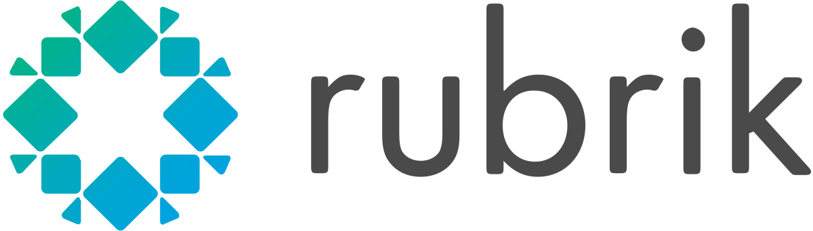
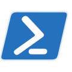
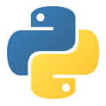

# Rubrik API Integrations for Every Use Case
Integrating Rubrik into your enterprise tools and workflows has never been easier. 

## Project Types

Rubrik has three different types of projects centering around API consumption:

* **SDKs** - SDKs allow the creation of applications in a specific programming language
* **Tooling Integrations** - Tooling Integrations seamlessly integrate with Rubrik to make testing, development or monitoring tasks easier and more efficient
* **Use Cases** - Use Cases are automated workflows that can be leveraged in your envionment to achieve a very specific goal

## Support
Depending on the SDK, Integration, or Use Case one of the following support models are applied:

* **Rubrik Supported** - a project that is owned and maintained by Rubrik while accepting contributions from the community
* **Community Supported** - a project that is owned and maintained by the Build community
* **Partner Supported** - a project that is owned and maintained by a Partner and Rubrik while accepting contributions from the community

The `README.md` of each repository should designate the project type.

## Project Listing

### Rubrik Supported

The following projects are officially supported by Rubrik

<table align="center">
  <tr>
    <td align="center">
       
      Rubrik Security Cloud Powershell SDK  
      <a href="">Code</a> | <a href="">Documentation</a> | <a href="">Quickstart</a>
    </td>
    <td align="center"> Rubrik Security Cloud Python SDK  <<a href="">Code</a> | <a href="">Documentation</a> | <a href="">Quickstart</a></td>
    <td align="center"> Rubrik Security Cloud GO SDK  <a href="">Code</a> | <a href="">Documentation</a> | <a href="">Quickstart</a></td>
  </tr>
  <tr>
    <td align="center"> Rubrik Security Cloud Terraform Plugin  <a href="">Code</a> | <a href="">Documentation</a> | <a href="">Quickstart</a></td>
    <td align="center"> Rubrik Security Cloud Service Now Integration  <a href="">Code</a> | <a href="">Documentation</a> | <a href="">Quickstart</a></td>
    <td align="center"> Rubrik Security Cloud vRA/vRO Plugin  <a href="">Code</a> | <a href="">Documentation</a> | <a href="">Quickstart</a></td>
  </tr>
</table>

## Contributing

A first step to contributing is to pick an existing project or to submit an idea for a new project.

Projects will often have issues, which can be either a bug fix or enhancement request, that are labeled as [`first-timer`](https://github.com/search?q=org%3Arubrikinc+is%3Aopen+label%3Afirst-timer&unscoped_q=is%3Aopen+label%3Afirst-timer) or [`exp-beginner`](https://github.com/search?q=org%3Arubrikinc+is%3Aopen+label%3Aexp-beginner) that can help new contributors get involved.

The [Contributor Guide](contributors/guide/README.md) provides detailed instruction on how to get your ideas and bug fixes seen and accepted, including:

1. How to [file an issue](https://github.com/rubrikinc/welcome-to-rubrik-build/blob/master/contributors/guide/issue-handling.md)
1. How to [find something to work on](https://github.com/rubrikinc/welcome-to-rubrik-build/blob/master/contributors/guide/labels.md)
1. How to [open a pull request](https://github.com/rubrikinc/welcome-to-rubrik-build/blob/master/contributors/guide/submitting-pull-requests.md)

## Membership

We encourage all contributors to become members. We aim to grow an active, healthy community of contributors, reviewers, and code owners. Learn more about requirements and responsibilities of membership in our [Community Membership](https://github.com/rubrikinc/welcome-to-rubrik-build/tree/master/community) page.

All contributors are expected to abide by the [Code of Conduct](https://github.com/rubrikinc/welcome-to-rubrik-build/blob/master/Code-of-Conduct.md).
